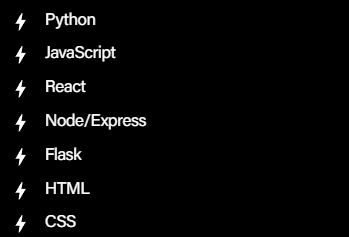

<!--
**truth-josstice/truth-josstice** is a ✨ _special_ ✨ repository because its `README.md` (this file) appears on your GitHub profile.

Here are some ideas to get you started:

- 🔭 I’m currently working on ...
- 🌱 I’m currently learning ...
- 👯 I’m looking to collaborate on ...
- 🤔 I’m looking for help with ...
- 💬 Ask me about ...
- 📫 How to reach me: ...
- 😄 Pronouns: ...
- ⚡ Fun fact: ...
-->

## *"Truth & Josstice"* 
What's that all about? Well, it's my usual online handle,so it's me! It's also a little bit about me!

😸 My name is **Joss**, pronouns are **he/him**, and I'm just getting started on the git journey! I'm constantly curious and looking to learn, so I'm looking to uncover all of the hidden truths about coding! 

🧑‍💻 I'm currently learning Full Stack Web Development in a BootCamp style course. We have so far worked on:
- HTML
- CSS
- Markdown
- Wireframing
- Git & Ubuntu

🏃‍♂️‍➡️ Since I'm just at the start of the journey, I'm familiar with the bare bones of HTML and CSS. 

We will also cover a whole bunch of other subjects:

🦇 A fun fact about me? I'm a pop culture trivia buff, so ask me about anything pop culture related and I'll (hopefully) know the answer! Otherwise it will just give me yet another thing to watch!