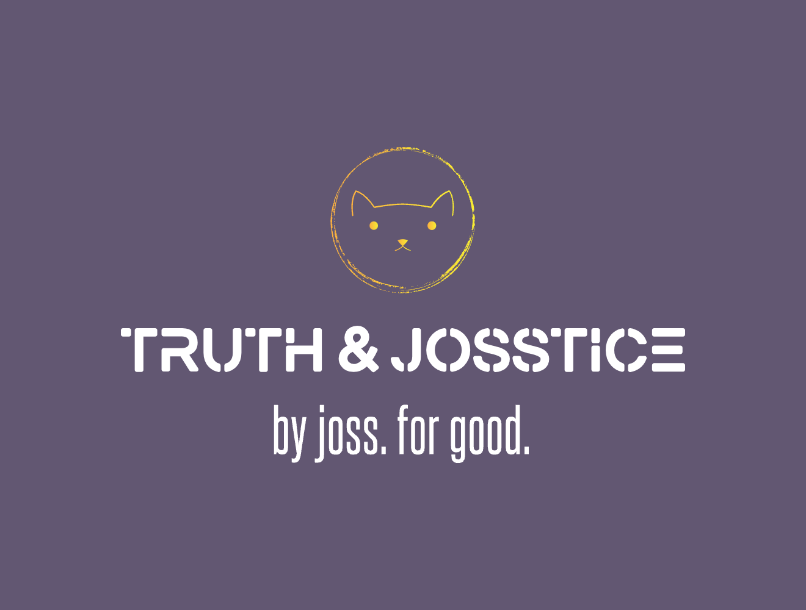

# *"Truth & Josstice"*

What's that all about? Well, it's my usual online handle, so it's me! It's also a little bit about me!

I live by a sense of personal and community justice, and always filter my actions through a harm-reduction mindset. The ethics of web-development are of key focus for me, as well as honest, open, and supportive collaboration. 

😸 My name is **Joss**, pronouns are **he/him**! I'm constantly curious and looking to learn, - I thrive getting thrown in the deep end, learning on the go has always lead to really positive outcomes for me. So coding? That's a deep deep deep end! I am excited to continue learning not only what I studied, but other languages and platforms as well!

🧑‍💻 I've recently completed a Diplome of Full Stack Web Development (**BootCamp style**) at CoderAcademy - completed with High Distinction in February 2026! Here's what I've been building:

---

## Technical Skills & Project Implementation

| Category | Technology/Skill | Implementation & Project Experience |
|----------|------------------|-------------------------------------|
| **Backend** | Node.js + Express | Built RESTful APIs with MVC architecture; implemented JWT authentication, middleware, and CRUD operations for full-stack applications |
| **Database** | MongoDB + Mongoose | Designed NoSQL schemas with validation, relationships, and middleware hooks; implemented data sanitization and aggregation |
| **Database** | PostgreSQL + SQLAlchemy | Created relational database schemas with ACID compliance; built complex joins and aggregate functions for climbing tracker |
| **Authentication** | JWT + bcrypt | Implemented secure user authentication with password hashing (12 salt rounds) and protected route middleware |
| **Testing** | Jest + Supertest | Wrote unit tests for models, schemas, and API endpoints; used in-memory databases for isolated testing |
| **DevOps** | CI/CD Pipelines + Cloud Deployment | Automated deployments via GitHub Actions; deployed full-stack applications on Render, Firebase, Neon PostgreSQL, MongoDB Atlas, Google Cloud Run; incorporated containerisation via Docker and Docker Hub |
| **Security** | Helmet + CORS | Configured security headers and cross-origin resource sharing for production deployment |
| **Development** | Git + Agile/Kanban | Practiced version control with feature branching and Agile methodologies using Trello for project management |
| **Architecture** | MVC Pattern | Implemented separation of concerns with Models (Mongoose), Views (React), Controllers (Express) |
| **API Design** | RESTful Principles | Designed REST APIs with proper HTTP verbs, status codes, and JSON responses for multiple projects |

## Key Project Demonstrations

- **The Century Screening Room** - Tech Lead & Full Stack Architect
  - Full MERN stack with user profiles, OMDb API integration, and comprehensive testing suites automated with CI/CD Pipeline through GitHub Actions. Led a team of three to deliver MVP on deadline using Agile methodology.
  - [GitHub Repo](https://github.com/truth-josstice/DEV1004_Assessment03) | [Live on Firebase] (https://the-century-screening-room.web.app/)
- **Climbing Tracker API**: PostgreSQL relational database with complex relationships, JWT Authentication, full CRUD and aggregation queries
- **Blackjack Game**: Python CLI application demonstrating game logic and file I/O operations
- **Portfolio Design**: Responsive web design with focus on UX/UI principles and accessibility - will be updated shortly, as this was the very first assessment in my course!

All of my repositories are public, feel free to poke around and explore!

---

👯 I worked with an awesome team on our MERN stack project - you can find the organisation [here](https://github.com/CoderAcademy-DEV-MERN-Group)!

🦇 A fun fact about me? I'm a pop culture trivia buff, so ask me about anything pop culture related and I'll (hopefully) know the answer! Otherwise it will just give me yet another thing to watch! I'm also a keen boulderer, so I'm familiar with learning through failure, being kind to myself, and most of all, the slow progress of learning a nonintuitive skill! (Basically TDD for fitness and fun!)
