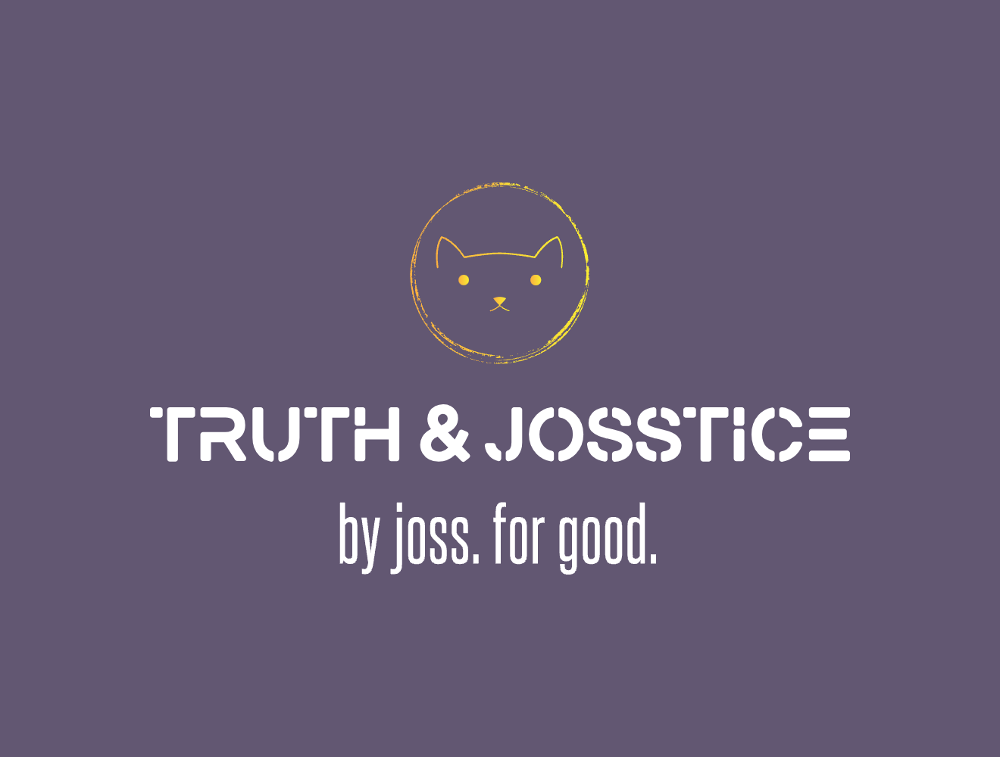

<!--
**truth-josstice/truth-josstice** is a ✨ _special_ ✨ repository because its `README.md` (this file) appears on your GitHub profile.

Here are some ideas to get you started:

- 🔭 I’m currently working on ...
- 🌱 I’m currently learning ...
- 👯 I’m looking to collaborate on ...
- 🤔 I’m looking for help with ...
- 💬 Ask me about ...
- 📫 How to reach me: ...
- 😄 Pronouns: ...
- ⚡ Fun fact: ...
-->

# *"Truth & Josstice"*

What's that all about? Well, it's my usual online handle, so it's me! It's also a little bit about me!

😸 My name is **Joss**, pronouns are **he/him**, and I'm just getting started on the git journey! I'm constantly curious and looking to learn, so I'm looking to uncover all of the hidden truths about coding!

🧑‍💻 I'm currently completing a Full Stack Web Development Diploma in a BootCamp style course, which will finish up in February 2026!

🏃‍♂️‍➡️ We will also cover a whole bunch of languages, we are currently working on a MERN stack project!

🔭 If you want to see the projects I've been working on, all of my repositories are public and you can see the languages I've used so far! 

👯 I’m part of a three person group working through our MERN stack project, you can find the organisation [here](https://github.com/CoderAcademy-DEV-MERN-Group)!

🦇 A fun fact about me? I'm a pop culture trivia buff, so ask me about anything pop culture related and I'll (hopefully) know the answer! Otherwise it will just give me yet another thing to watch!
